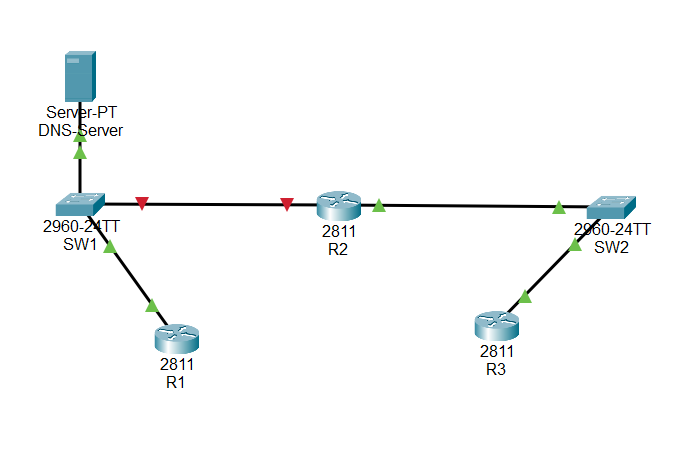
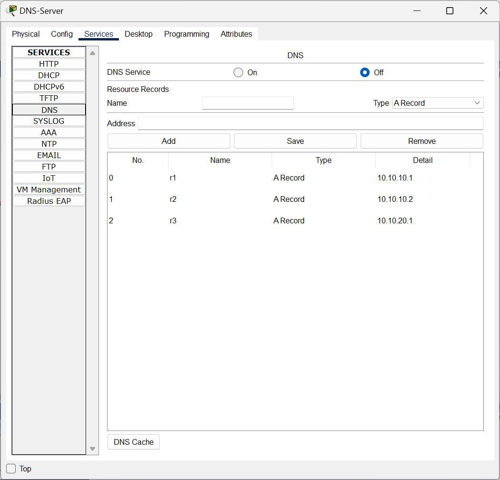

RCA-001 Evidence Log
Title: DNS Resolution Failure / Connectivity Validation
Date: 2026-01-18
Lab: Cisco Packet Tracer

============================================================
### [1] TOPOLOGY / CONTEXT
- Devices: R1, R2, R3, DNS Server
- DNS Server IP: 10.10.10.10
- Test Hostname(s): r1, r3

Screenshot Files:

============================================================
### [2] BEFORE STATE (SYMPTOMS)

Ping Tests (Connectivity Check)

R1
R1> enable
R1# ping 10.10.20.1
.....
Success rate is 0 percent (0/5)
Result: Success rate 0%

R3
R3> enable
R3# ping 10.10.10.1
.U.U.
Success rate is 0 percent (0/5)
Result: Success rate 0%

------------------------------------------------------------
### [Interface Status]

Switch> enable
Switch# show ip interface brief
FastEthernet0/2 is down (administratively down)

Result: Switch FastEthernet0/2 is administratively down, contributing to connectivity issues.

R2> enable
R2# show ip interface brief
FastEthernet0/0 10.10.10.2 administratively down down
FastEthernet1/0 10.10.20.2 up up

Result: R2 FastEthernet0/0 is administratively down, blocking access to 10.10.10.0/24.

------------------------------------------------------------
### [Routing Table Check] 

R3# show ip route
S 10.10.10.0 via 10.10.20.2
C 10.10.20.0 is directly connected

R2# show ip route
C 10.10.20.0 is directly connected

Result: R2 only knows 10.10.20.0 is directly connected. This is a connectivity issue, not only DNS.

------------------------------------------------------------
### [DNS Client Config]

R1# show run | include name-server
ip name-server 10.10.10.10

R3# show run | include name-server
ip name-server 10.10.10.1

Result: R1 has the correct DNS server configured. R3 has an incorrect DNS server configured and lacks connectivity to the correct DNS server.

============================================================
### [3] FIX APPLIED
Commands used:
<RCA-001 Evidence Log
Title: DNS Resolution Failure / Connectivity Validation
Date: 2026-01-18
Lab: Cisco Packet Tracer

### [Routing Table Check] (Optional)

R3# show ip route
S 10.10.10.0 via 10.10.20.2
C 10.10.20.0 is directly connected

R2# show ip route
C 10.10.20.0 is directly connected

Result: R2 only knows 10.10.20.0 is directly connected. This is a connectivity issue, not only DNS.

------------------------------------------------------------
### [DNS Client Config]

R1# show run | include name-server
ip name-server 10.10.10.10

R3# show run | include name-server
ip name-server 10.10.10.1

Result: R1 has the correct DNS server configured. R3 has an incorrect DNS server configured and lacks connectivity to the correct DNS server.

============================================================
## [3] FIX APPLIED

### Switch – Enable Port to Restore Connectivity
Switch> enable
Switch# configure terminal
Switch(config)# interface fastethernet0/2
Switch(config-if)# no shutdown
### R2 – Enable Interface to Restore 10.10.10.0/24 Reachability
R2> enable
R2# configure terminal
R2(config)# interface fastethernet0/0
R2(config-if)# no shutdown
### R3 – Correct DNS Configuration (Enable Name Resolution)
R3> enable
R3# configure terminal
R3(config)# ip domain-lookup
R3(config)# ip name-server 10.10.10.10
R3(config)# end
### Quick Verification (Hostname Ping)
R3# ping r1
Translating "r1"...domain server (10.10.10.10)
Type escape sequence to abort.
Sending 5, 100-byte ICMP Echos to 10.10.10.1, timeout is 2 seconds:
.!!!!
Success rate is 80 percent (4/5), round-trip min/avg/max = 0/7/19 ms

**Turned DNS service ON**

============================================================
### [4] AFTER STATE (VALIDATION)

### Hostname Ping (DNS + Connectivity)

R1
R1> enable
R1# ping r3
Translating "r3"...domain server (10.10.10.10)
Type escape sequence to abort.
Sending 5, 100-byte ICMP Echos to 10.10.20.1, timeout is 2 seconds:
!!!!!
Success rate is 100 percent (5/5), round-trip min/avg/max = 0/11/34 ms

R3
R3# ping r1
Translating "r1"...domain server (10.10.10.10)
Type escape sequence to abort.
Sending 5, 100-byte ICMP Echos to 10.10.10.1, timeout is 2 seconds:
.!!!!
Success rate is 80 percent (4/5), round-trip min/avg/max = 0/7/19 ms

Note: The first ping may drop due to ARP initialization; subsequent attempts typically succeed (5/5).

------------------------------------------------------------
### Traceroute Validation (Path Check)

R3
R3# traceroute r1
Type escape sequence to abort.
Tracing the route to 10.10.10.1

  1   10.10.20.2      10 msec   2 msec    0 msec
  2   10.10.10.1      12 msec   0 msec    10 msec

R1
R1# traceroute r3
Type escape sequence to abort.
Tracing the route to 10.10.20.1

  1   10.10.10.2      82 msec   0 msec    1 msec
  2   10.10.20.1      13 msec   9 msec    14 msec   

============================================================
### [5] SUMMARY
- Root cause: Switch FastEthernet0/2 and R2 FastEthernet0/0 were administratively down, breaking connectivity between networks. R3 also had an incorrect DNS server configured (10.10.10.1 instead of 10.10.10.10), preventing hostname resolution.
- Fix: Enabled the required interfaces (no shutdown) on the switch and R2, and corrected R3 DNS settings to use 10.10.10.10 (ip name-server 10.10.10.10).
- Verification result: Hostname resolution succeeded (ping r1/r3 via DNS), IP connectivity was restored, and traceroute confirmed traffic routed through R2 between 10.10.10.0/24 and 10.10.20.0/24.
============================================================>

